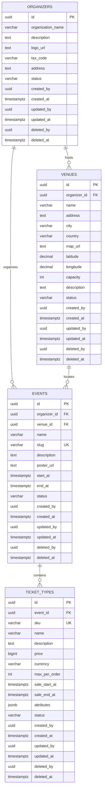

# Data Model - Event Service

```mermaid
erDiagram
    ORGANIZERS ||--o{ VENUES : hosts
    ORGANIZERS ||--o{ EVENTS : organizes
    VENUES ||--o{ EVENTS : locates
    EVENTS ||--o{ TICKET_TYPES : contains

    ORGANIZERS {
        uuid id PK
        varchar organization_name
        text description
        text logo_url
        varchar tax_code
        text address
        varchar status
        uuid created_by
        timestamptz created_at
        uuid updated_by
        timestamptz updated_at
        uuid deleted_by
        timestamptz deleted_at
    }

    VENUES {
        uuid id PK
        uuid organizer_id FK
        varchar name
        text address
        varchar city
        varchar country
        text map_url
        decimal latitude
        decimal longitude
        int capacity
        text description
        varchar status
        uuid created_by
        timestamptz created_at
        uuid updated_by
        timestamptz updated_at
        uuid deleted_by
        timestamptz deleted_at
    }

    EVENTS {
        uuid id PK
        uuid organizer_id FK
        uuid venue_id FK
        varchar name
        varchar slug UK
        text description
        text poster_url
        timestamptz start_at
        timestamptz end_at
        varchar status
        uuid created_by
        timestamptz created_at
        uuid updated_by
        timestamptz updated_at
        uuid deleted_by
        timestamptz deleted_at
    }

    TICKET_TYPES {
        uuid id PK
        uuid event_id FK
        varchar sku UK
        varchar name
        text description
        bigint price
        varchar currency
        int max_per_order
        timestamptz sale_start_at
        timestamptz sale_end_at
        jsonb attributes
        varchar status
        uuid created_by
        timestamptz created_at
        uuid updated_by
        timestamptz updated_at
        uuid deleted_by
        timestamptz deleted_at
    }
```
